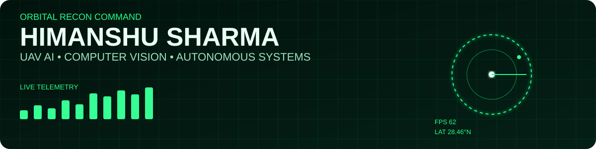
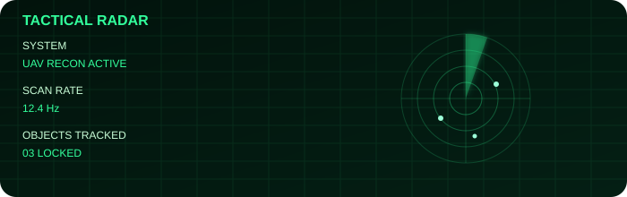
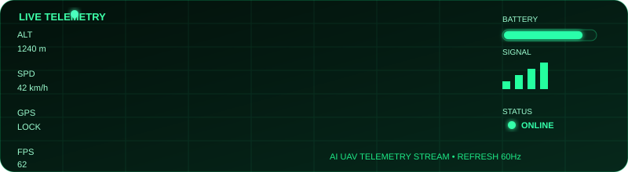

<div align="center">



# ORBITAL RECON COMMAND

### UAV AI • Computer Vision • Autonomous Systems

> Building autonomous aerial intelligence with Computer Vision, YOLO11, OpenCV, PyTorch & ROS2


</div>

---

# 🟢 LIVE TELEMETRY

| MODULE | STATUS |
|:--|:--|
| 🚗 Vehicle Traffic Analytics | 🟢 ONLINE |
| 🛣️ Runway Crack Detection | 🟢 ACTIVE |
| 🛰️ UAV Multi Object Tracking | 🟢 READY |
| 🤖 ROS2 Autonomous Navigation | 🟡 DEVELOPMENT |

---

# 📡 ACTIVE MISSIONS

- 🚗 **Mission 01** — Vehicle Traffic Analytics
- 🛣️ **Mission 02** — Runway Crack Detection
- 🛰️ **Mission 03** — UAV Multi Object Tracking
- 🤖 **Mission 04** — Autonomous Drone Navigation

---

# 🎯 MISSION DASHBOARD

<div align="center">


</div>

---

# 🚁 UAV FLEET REGISTRY

<div align="center">


</div>

---

# ⚙️ AI CORE

<div align="center">


</div>

---

# 📊 MISSION ANALYTICS

<div align="center">


</div>

---

# 🔥 OPERATIONAL METRICS

<div align="center">


</div>

---

# 🚀 FEATURED OPERATIONS

<div align="center">

| Project | Mission |
|----------|----------|
| 🚗 **Vehicle Traffic Analytics** | YOLO11 + DeepSORT real-time traffic intelligence |
| 🛣️ **Runway Crack Detection** | AI powered runway defect localization |
| 🛰️ **UAV Multi Object Tracking** | Multi-object aerial surveillance system |
| 🤖 **ROS2 Navigation** | Autonomous drone navigation framework |

</div>

---

# 🎓 CURRENT RESEARCH

```text
FOCUS AREA
│
├── UAV Computer Vision
├── Autonomous Navigation
├── Object Detection (YOLO11)
├── Multi Object Tracking
├── ROS2 Robotics
└── Deep Learning
```

---

# 🌍 MISSION STATUS

<div align="center">


</div>

---

<div align="center">

## SYSTEM MESSAGE

> **"Mission success is measured by autonomous precision."**

**ORBITAL RECON COMMAND • HIMANSHU SHARMA**

</div>

---

# 📊 TACTICAL ANALYTICS

<div align="center">


</div>

---

# 🔥 CONTRIBUTION HEATMAP

<div align="center">


</div>


---

# 🎯 TACTICAL RADAR

<div align="center">
  
</div>

## 📈 LIVE DRONE TELEMETRY

<div align="center">
  
</div>