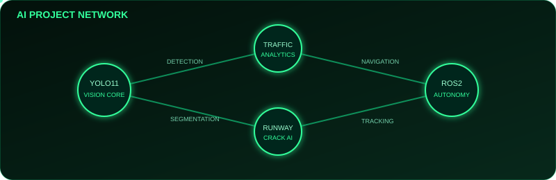
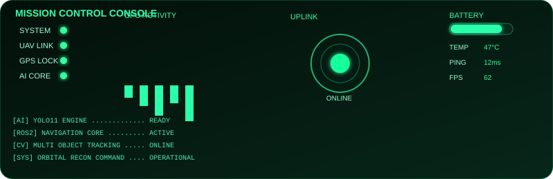
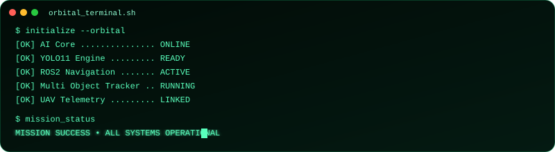

<div align="center">


# ORBITAL RECON COMMAND

### UAV AI • Computer Vision • Autonomous Systems

> Building autonomous aerial intelligence with Computer Vision, YOLO11, OpenCV, PyTorch & ROS2


</div>

---

# 🟢 LIVE TELEMETRY

| MODULE | STATUS |
|:--|:--|
| 🚗 Vehicle Traffic Analytics | 🟢 ONLINE |
| 🛣️ Runway Crack Detection | 🟢 ACTIVE |
| 🛰️ UAV Multi Object Tracking | 🟢 READY |
| 🤖 ROS2 Autonomous Navigation | 🟡 DEVELOPMENT |

---

# 📡 ACTIVE MISSIONS

- 🚗 **Mission 01** — Vehicle Traffic Analytics
- 🛣️ **Mission 02** — Runway Crack Detection
- 🛰️ **Mission 03** — UAV Multi Object Tracking
- 🤖 **Mission 04** — ROS2 Autonomous Navigation

---

# 🎯 MISSION DASHBOARD

<div align="center">
  
</div>

---

# 📡 AIRSPACE RADAR

<div align="center">
  

  **LIVE AIRSPACE SCAN**

  Target Lock • UAV Tracking • 360° Surveillance
</div>

---

# 📈 LIVE DRONE TELEMETRY

<div align="center">
  
</div>

---

# 🚁 UAV FLEET REGISTRY

<div align="center">
  
</div>

---

# 🛰️ AI PROJECT NETWORK

<div align="center">
  
</div>

---

# 🖥️ MISSION CONTROL CONSOLE

<div align="center">
  
</div>

---

# ⚙️ AI CORE

<div align="center">


</div>

---

# 📊 TACTICAL ANALYTICS

<div align="center">


</div>

---

# 🔥 CONTRIBUTION STREAK

<div align="center">


</div>

---

# 🚀 FEATURED OPERATIONS

| Project | Mission |
|:--|:--|
| 🚗 **Vehicle Traffic Analytics** | YOLO11 + DeepSORT real-time traffic intelligence |
| 🛣️ **Runway Crack Detection** | AI-powered runway defect localization |
| 🛰️ **UAV Multi Object Tracking** | Real-time aerial surveillance & tracking |
| 🤖 **ROS2 Navigation** | Autonomous drone navigation framework |

---

# 🛰️ FLAGSHIP PROJECTS

<table>
<tr>
<td width="50%">

### 🚗 Vehicle Traffic Analytics

**YOLO11 + DeepSORT + OpenCV**

Real-time vehicle detection, counting and speed estimation.

**Status:** 🟢 Operational

</td>
<td width="50%">

### 🛣️ Runway Crack Detection

**Deep Learning + Segmentation**

Automatic runway defect localization.

**Status:** 🟢 Active

</td>
</tr>

<tr>
<td width="50%">

### 🛰️ UAV Multi Object Tracking

**YOLO11 + Kalman Tracking**

Persistent aerial object tracking.

**Status:** 🟢 Ready

</td>
<td width="50%">

### 🤖 ROS2 Navigation

**Autonomous Robotics Framework**

Path planning & drone autonomy.

**Status:** 🟡 Development

</td>
</tr>
</table>

---

# 🎓 CURRENT RESEARCH

```text
FOCUS AREA
│
├── UAV Computer Vision
├── Autonomous Navigation
├── Object Detection (YOLO11)
├── Multi Object Tracking
├── ROS2 Robotics
└── Deep Learning
```

---

# 💻 ORBITAL TERMINAL

<div align="center">
  
</div>

---

# 🌍 MISSION STATUS

<div align="center">


</div>

---

<div align="center">

# ORBITAL RECON COMMAND

### HIMANSHU SHARMA

**UAV AI • Computer Vision • Autonomous Systems**

> *Mission success is measured by autonomous precision.*

</div>