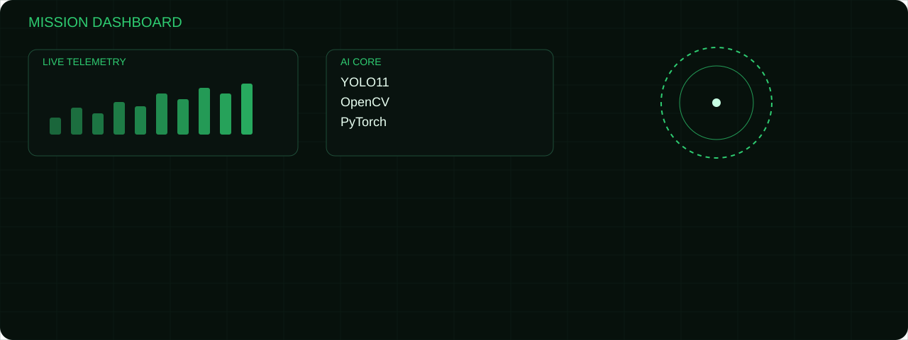
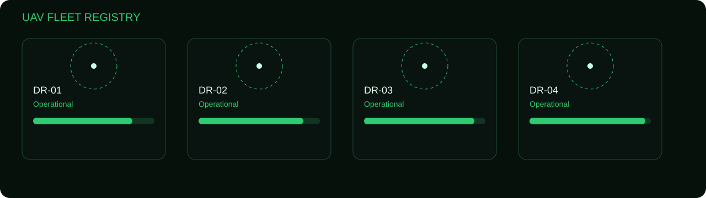

<<<<<<< HEAD

# ORBITAL RECON COMMAND

`UAV AI • Computer Vision • Autonomous Systems`

# ORBITAL RECON COMMAND

### UAV AI • Computer Vision • Autonomous Systems

> Building autonomous aerial intelligence with Computer Vision, YOLO, ROS2 and Deep Learning.
(Create tactical GitHub profile HUD)

---

## 🟢 LIVE TELEMETRY

| MODULE | STATUS |
|:--|:--|
| Vehicle Traffic Analytics | 🟢 ONLINE |
| Runway Crack Detection | 🟢 ACTIVE |
| UAV Object Tracking | 🟢 READY |
| ROS2 Navigation | 🟡 BUILDING |

---

## 📡 ACTIVE MISSIONS

🔹 Mission 01 — Vehicle Traffic Analytics

🔹 Mission 02 — Runway Integrity AI

🔹 Mission 03 — UAV Multi Object Tracking

---

## ⚙️ AI CORE

`Python` `YOLO11` `OpenCV` `PyTorch` `ROS2` `Git` `Linux`
=======
## MISSION DASHBOARD

  

---

## CURRENT OPERATIONS

| Mission | Status |
|---------|--------|
| 🚗 Vehicle Traffic Analytics | 🟢 OPERATIONAL |
| 🛣️ Runway Crack Detection | 🟢 ACTIVE |
| 🛰️ UAV Multi Object Tracking | 🟢 READY |
| 🤖 ROS2 Autonomous Navigation | 🟡 DEVELOPMENT |

---

## UAV FLEET REGISTRY

  

---

## AI CORE

  
  
  
  
  
  

---

### SYSTEM MESSAGE

**"Mission success is measured by autonomous precision."**

>>>>>>> e14eb84 (Create tactical GitHub profile HUD)
